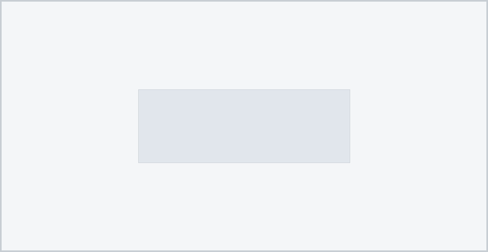

# health_dash

A small [R Shiny](https://shiny.posit.co/) dashboard showcasing three figures
commonly used in epidemiology and clinical research:

1. **Table 1** — a demographic summary table for a non-alcoholic fatty liver
   disease (NAFLD) cohort, split by vital status.
2. **Survival curves** — Kaplan–Meier survival plots (with confidence
   intervals, a log-rank *p*-value, and a risk table) for a rat
   tumour-incidence study, by treatment group and sex.
3. **Treatment switching** — a Sankey / alluvial diagram showing how patients
   move between antidepressant medications over 24 months.

> **Note on the data:** the NAFLD and rat datasets ship with the
> [`survival`](https://cran.r-project.org/package=survival) package. The
> treatment-switching data is **fabricated** for illustration purposes only.

## Screenshot



> _Placeholder._ To add a real screenshot, run the app (see below), take a
> capture of the browser window, and save it to `docs/screenshot.png`.

## Requirements

- **R** 4.0 or newer ([download](https://cran.r-project.org/))
- The following R packages:

  | Package      | Purpose                                  |
  | ------------ | ---------------------------------------- |
  | `shiny`      | Web application framework                |
  | `survival`   | `nafld1` / `rats` datasets, survival fit |
  | `survminer`  | `ggsurvplot()` survival curves           |
  | `dplyr`      | Data wrangling                           |
  | `table1`     | "Table 1" demographic summaries          |
  | `ggplot2`    | Plotting                                 |
  | `ggalluvial` | Alluvial / Sankey diagrams               |

## Setup

Install the required packages from an R console:

```r
install.packages(c(
  "shiny", "survival", "survminer",
  "dplyr", "table1", "ggplot2", "ggalluvial"
))
```

## Running the app

From an R console, point `shiny` at the app directory:

```r
shiny::runApp("health_dash")
```

Or from the command line:

```sh
Rscript -e 'shiny::runApp("health_dash", launch.browser = TRUE)'
```

The app opens in your browser. Use the left-hand navigation list to switch
between the three figures; on the survival tab, the **Treatment Group**
dropdown re-fits the curves for the selected group.

## Project layout

```
health_dash/
├── health_dash/
│   └── app.R          # the Shiny app (UI + server)
├── docs/
│   └── screenshot.png # dashboard screenshot (add your own)
├── project.Rproj      # RStudio project file
└── README.md
```
